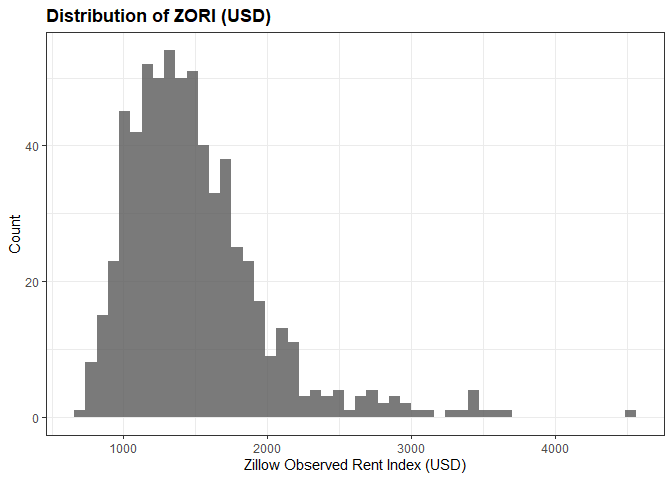
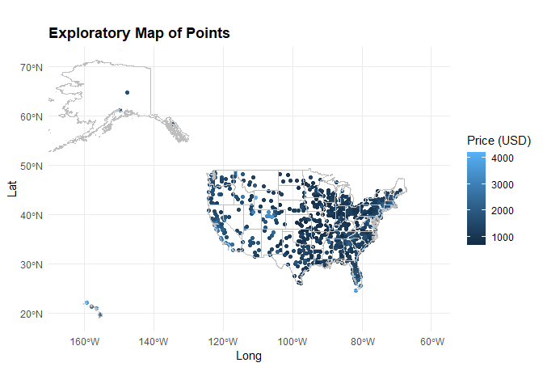
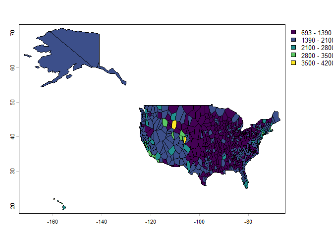
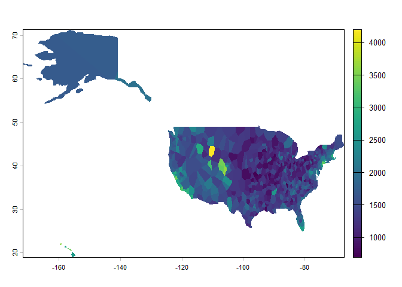
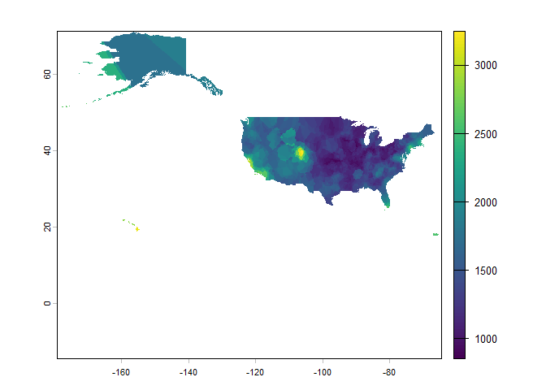
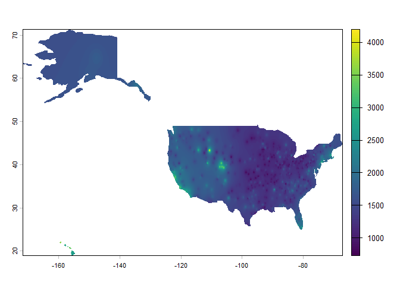
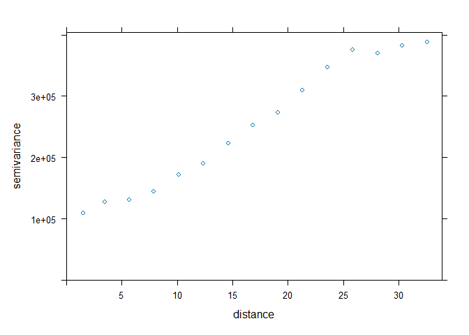
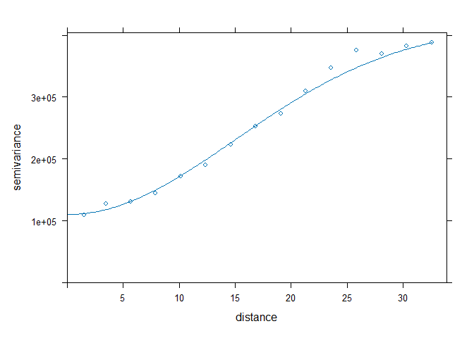
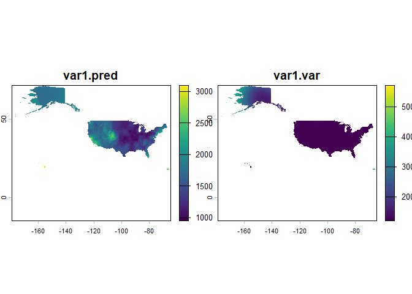
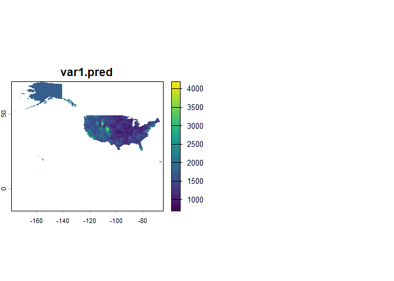

# Interpolated Zillow Rental Data
Luke Petrus

## Packages & Housekeeping

``` r
library(tidyverse)
library(sf)
library(terra)
library(tidygeocoder)
library(leaflet)
library(gstat)
library(knitr)
```

## Introduction

I’ve been doing some reading and I read that Quarto is designed to be
used as a modern data science lab notebook, so here’s me trying to do
that. My goal here is to create a raster surface that contains values
interpolated from a layer of points describing rent in various
locations. I’ve obtained a Zillow data set that suits my needs and
provides values for 707 metropolitan statistical areas in the United
States. Hopefully, that is enough to generate a meaningful
interpolation. If not, I will look into using each individual rental as
a point, scraping the data from Zillow in real time. Eventually, this is
likely the path I would like to follow to make the data as current as
possible at all times.

``` r
# reads in my data from zillow's website
rentalData <- read_csv("https://files.zillowstatic.com/research/public_csvs/zori/Metro_zori_uc_sfrcondomfr_sm_month.csv?t=1765493039")
```

#### A Note on ZORI

ZORI stands for Zillow Observed Rent Index. This is defined as:

> A smoothed measure of the typical observed market rate rent across a
> given region. ZORI is a repeat-rent index that is weighted to the
> rental housing stock to ensure representativeness across the entire
> market, not just those homes currently listed for-rent. The index is
> dollar-denominated by computing the mean of listed rents that fall
> into the 35th to 65th percentile range for all homes and apartments in
> a given region, which is weighted to reflect the rental housing
> stock. -
> [Zillow](https://www.zillow.com/research/data/ "Zillow Housing Data Portal")

While this may not capture the full breadth of affordability available
in an area, it should give me enough to create a basic model. As stated,
my eventual preferred option is to interpolate from individual rental
listings scraped for the entire country on a daily basis. Before
investing in that resource-intensive model, I wish to proof-of-concept
this map with the easily available data Zillow has provided.

## EDA

#### Histogram of Rent Distribution

``` r
ggplot(rentalData) +
  geom_histogram(aes(x = `2025-11-30`), bins = 50, alpha = 0.8) +
  labs(
    title = "Distribution of ZORI (USD)",
    y = "Count",
    x = "Zillow Observed Rent Index (USD)"
  ) +
  theme_bw() +
  theme(plot.title = element_text(face = "bold"))
```

    Warning: Removed 45 rows containing non-finite outside the scale range
    (`stat_bin()`).



#### Top 10 Most Expensive Metros

``` r
top10 <- rentalData |> 
  arrange(desc(`2025-11-30`)) |>
  select(RegionName, SizeRank, `2025-11-30`) |> 
  slice_head(n = 10)

kable(top10)
```

| RegionName       | SizeRank | 2025-11-30 |
|:-----------------|---------:|-----------:|
| Jackson, WY      |      768 |   4524.757 |
| Key West, FL     |      442 |   3659.839 |
| Kapaa, HI        |      478 |   3574.852 |
| Breckenridge, CO |      811 |   3546.622 |
| Santa Maria, CA  |      124 |   3426.269 |
| Santa Cruz, CA   |      183 |   3404.548 |
| San Jose, CA     |       36 |   3395.053 |
| Edwards, CO      |      566 |   3393.392 |
| Kahului, HI      |      267 |   3363.204 |
| New York, NY     |        1 |   3236.986 |

#### Top 10 Least Expensive Metros

``` r
bottom10 <- rentalData |> 
  arrange(desc(`2025-11-30`)) |>
  select(RegionName, SizeRank, `2025-11-30`) |> 
  slice_tail(n = 10) |> 
  arrange(`2025-11-30`)

kable(bottom10)
```

| RegionName        | SizeRank | 2025-11-30 |
|:------------------|---------:|-----------:|
| Weatherford, OK   |      831 |         NA |
| Crescent City, CA |      840 |         NA |
| Altus, OK         |      864 |         NA |
| Mitchell, SD      |      878 |         NA |
| Maryville, MO     |      895 |         NA |
| Price, UT         |      912 |         NA |
| Los Alamos, NM    |      916 |         NA |
| Andrews, TX       |      920 |         NA |
| Snyder, TX        |      926 |         NA |
| Vermillion, SD    |      932 |         NA |

#### My Favorite Places

``` r
favPlaces <- rentalData |> 
  filter(RegionName %in% c("Bozeman, MT", "Seattle, WA", "Portland, ME", "Missoula, MT", "Sacramento, CA", "Williamsport, PA", "Philadelphia, PA")) |> 
  select(RegionName, SizeRank, `2025-11-30`) |> 
  arrange(desc(`2025-11-30`))

kable(favPlaces)
```

| RegionName       | SizeRank | 2025-11-30 |
|:-----------------|---------:|-----------:|
| Sacramento, CA   |       26 |   2216.482 |
| Portland, ME     |      105 |   2213.953 |
| Seattle, WA      |       15 |   2194.650 |
| Bozeman, MT      |      356 |   2103.851 |
| Philadelphia, PA |        7 |   1849.130 |
| Williamsport, PA |      359 |   1780.298 |
| Missoula, MT     |      354 |   1519.716 |

## Geo-coding

A quick internet search revealed that the problem I identified—adding
lat and long to my data—is called geocoding, something I vaguely
remember talking about in one of my GIS classes. Some further reading
revealed that there are several ways to do this, but I’ve decided to go
with the `tidygeocoding` package.

``` r
# Separates the city from the state and deletes the state from RegionName (there is already a StateName column)
clRentalData <- rentalData |> 
  mutate(RegionName = str_split_i(rentalData$RegionName, ",", 1) |> 
           str_remove_all(",")
        )

# Does the batch geocoding and adds Lat/Long columns to my data
geoData <- clRentalData |> 
  geocode(city = RegionName, state = StateName, method = "geocodio", lat = "Lat", long = "Long", verbose = T)

# Saves this data to a csv so I don't keep having to use the geocoding service.
write_csv(geoData, "geoData.csv")
```

I don’t want to keep using this geocoding service since it costs money
after 2,500 entries a day, so I’ve set the block above not to evaluate
and instead I am substituting the block below to load the geocoded data
from where I saved it.

``` r
# Reads in the saved data generated when the last step was performed.
geoData <- read_csv("geoData.csv")
```

And now for an accuracy test. . .

``` r
# For EDA. Not evaluating in the .md

# Generate a leaflet map to check the alignment of the geocoding against an Esri basemap
leaflet(geoData) |> 
  addProviderTiles("Esri.WorldStreetMap") |> 
  setView(lng = -80, lat = 40, zoom = 7) |> 
  addMarkers(lng = ~Long,
             lat = ~Lat,
             label = ~RegionName)
```

``` r
# Loads packages needed for AK & HI
library(rnaturalearth)
```

    Warning: package 'rnaturalearth' was built under R version 4.5.2

``` r
library(rnaturalearthdata)
```

    Warning: package 'rnaturalearthdata' was built under R version 4.5.2


    Attaching package: 'rnaturalearthdata'

    The following object is masked from 'package:rnaturalearth':

        countries110

``` r
# Reads in data as a sf
usaMap <- ne_states("united states of america", returnclass = "sf")

# Generates a simple exploratory map
ggplot() +
  geom_point(data = geoData, aes(x = Long, y = Lat, color = `2025-11-30`)) +
  geom_sf(data = usaMap, fill = NA, color = "grey") +
  coord_sf(xlim = c(-165, -60)) +
  labs(
    title = "Exploratory Map of Points",
    dictionary = c(`2025-11-30` = "Price (USD)")
  ) +
  theme_minimal() +
  theme(plot.title = element_text(face = "bold"))
```



I noticed while looking at the leaflet map that there is a pin for
“United States.” This is wrong. “United States” is the very first value
in the data set (SizeRank == 0), and just provides a national average. I
do not need this and it doesn’t fit the format of my data, so I removed
it. I may end up wanting that value later for something, so it is good
that it remains in other data sets above.

``` r
# Removes that observation.
geoData <- geoData |> 
  filter(RegionName != "United States") |> 
  rename_with(.fn = ~ paste0("X", str_replace_all(.x, "-", "_"))) # added later
```

## Interpolation

Now that I have the data I need to generate points, I can interpolate
from those points. Thankfully, I have Robert J. Hijman’s fabulous
*Spatial Data Analysis with R* to guide me.

``` r
# all credit for this function goes to Hijman, although I understand what is happening
RMSE <- function(observed, predicted) {
  sqrt(mean((predicted - observed)^2, na.rm = T))
}
# This will be used later to evaluate the models.
```

Now, I believe I need to turn my data into a vector layer.

``` r
# Turn my data into a vector of points
vectData <- vect(geoData, c("XLong", "XLat"), crs = "EPSG:4326")

# grab a U.S. shapefile I happen to have and vectorize that as well for cropping
vectUSA <- vect("C:/Users/Luke/OneDrive/Documents/Cartography/Shapefiles/Census.gov/cb_2018_us_state_500k/cb_2018_us_state_500k.shp", crs = "EPSG:3857")
```

#### Proximity Polygon Interpolation

As always, standing on the shoulders of giants. I have only the vaguest
idea what a Voronoi is. Aaaand after a quick google search, now I
understand. A Voronoi diagram is a diagram that breaks an area scattered
with nodes up into polygons such that all hypothetical points within an
area are closer to the node in that area than any other node.

``` r
# Create the voroni map
voronoiData <- voronoi(vectData)

# crop it to the united states
voronoiDataUSA <- crop(voronoiData, vectUSA)

#plot the map symbolized by the most recent rent data
plot(voronoiDataUSA, "X2025_11_30")
```



Next step is to rasterize this data.

``` r
r <- rast(ext(voronoiDataUSA), res = 0.05, crs = crs(voronoiDataUSA))
rasterData <- rasterize(voronoiDataUSA, r, field = "X2025_11_30")
plot(rasterData)
```



Now, I’m going to attempt Hijman’s 5-fold cross-validation method to
calculate RMSE for this interpolation. 5-fold cross-validation is a
specific type of k-fold validation where k = 5. It generates rmse
estimates by breaking the data into 5 groups or folds, using 4 of the
folds to train the model and the 5th to test it. This cycles through
until all 5 folds have been used to test against the other 4.

``` r
# Creates an index the same length as the data from which to assign the data to folds
set.seed(12)
kf <- sample(1:5, nrow(vectData), replace = T)

# Generates an empty vector to store the rmse for each fold in
rmse <- rep(NA, 5)

for (k in 1:5){
  test <- vectData[kf == k, ] #selects the test fold
  train <- vectData[kf != k, ] #selects the train fold
  v <- voronoi(train) #generates a voronoi diagram from the training set
  p <- extract(v, test) #extracts predictions for the test set from the voronoi diag
  rmse[k] <- RMSE(test$X2025_11_30, p$X2025_11_30) # tests the predicted values against the observed.
}

rmse
```

    [1] 371.1283 382.2459 451.3659 346.0828 404.6336

``` r
ProxRMSE <- mean(rmse)
ProxRMSE
```

    [1] 391.0913

That’s great, appears to work. I read that a 10-fold cross-validation
can be good for small datasets, so lets see what I get if I modify this
to do that. (Lets also see if I understand what’s happening well enough
to modify it)

``` r
# changed 1:5 to 1:10
set.seed(12)
kf10 <- sample(1:10, nrow(vectData), replace = T)

# Changed vector to be 10 elements long
rmse10 <- rep(NA, 10)

# changed for loop to iterate across 1:10
for (k in 1:10){
  test10 <- vectData[kf10 == k, ] 
  train10 <- vectData[kf10 != k, ] 
  v10 <- voronoi(train10) 
  p10 <- extract(v10, test10) 
  rmse10[k] <- RMSE(test10$X2025_11_30, p10$X2025_11_30)
}

rmse10
```

     [1] 413.0983 350.4771 495.2998 348.6694 388.2650 379.5555 389.0484 386.3341
     [9] 300.7706 406.9773

``` r
ProxRMSE10 <- mean(rmse10)
ProxRMSE10
```

    [1] 385.8495

This is all wonderful, but what, exactly, does that RMSE mean? Well, we
need a null model to compare it against. In this case, we can use the
national mean ZORI as our null model. Therefore, to generate the null I
can write:

``` r
null <- RMSE(mean(geoData$X2025_11_30), geoData$X2025_11_30)
null
```

    [1] 503.4211

From this, we can now generate a relative performance statistic to rank
our estimates against the null.

``` r
perfProx <- round((1 - (ProxRMSE10 / null)), 3)
perfProx
```

    [1] 0.234

Can we do better than this? Let’s try some other types of interpolation.

#### Nearest Neighbor Interpolation

``` r
d <- data.frame(geom(vectData)[, c("x", "y")], as.data.frame(vectData))

# Creates a geostatistical model to use with the interpolate() function
gsNNI <- gstat(formula = X2025_11_30 ~ 1, # designates simple krieging on this variable
            locations = ~x+y,
            data = d,
            nmax = 5, # max number of neighbors to consider for krieging
            set = list(idp = 0) # inverse distance power = 0 means all 5 neighbors equally weighted
            )
# interpolates to a raster based on the spatial model
  # **Very large operation/file**
NNI <- interpolate(r, gsNNI, debug.level = 0)

NNIMask <- mask(NNI, rasterData)

plot(NNIMask, 1)
```



I wonder if leaflet will let me have a closer look at this map. . .

``` r
leaflet() |> 
  addRasterImage(NNIMask) |> 
  setView(lng = -100, lat = 38, zoom = 3)
```

How about that. This is certainly a more visually appealing
interpolation, but is it more accurate as well? Let’s do another 10-fold
cross-validation and pray it doesn’t blow up my computer.

``` r
rmse10_2 <- rep(NA, 10)

for (k in 1:10){
  testNNI <- d[kf10 == k, ]
  trainNNI <- d[kf10 != k, ]
  gsNNITrain <- gstat(formula = X2025_11_30 ~ 1, 
            locations = ~x+y,
            data = trainNNI,
            nmax = 5,
            set = list(idp = 0))
  pNNI <- predict(gsNNITrain, testNNI, debug.level = 0)$var1.pred
  rmse10_2[k] <- RMSE(testNNI$X2025_11_30, pNNI)
}

rmse10_2
```

     [1] 377.0274 336.3060 475.5103 360.4359 349.3331 369.6207 306.0937 341.7098
     [9] 311.8653 326.2154

``` r
NNIRMSE <- mean(rmse10_2)
NNIRMSE
```

    [1] 355.4118

And the relative performance:

``` r
perfNNI <- round((1 - (NNIRMSE / null)), 3)
perfNNI
```

    [1] 0.294

Not too shabby! That’s a sizable gain over the Proximity Polygons
method, although I would still like to do better. Next up is Inverse
Distance Weighting.

#### Inverse Distance Weighting

Unlike the last method, this method allows for weights to be determined
by proximity. This is perhaps the most common way to do interpolation,
since it parallels Toebler’s law of geography that near things are more
alike than far things. As such, I expect that this interpolation will be
even more accurate than the last, but we shall see.

``` r
gsIDW <- gstat(formula = X2025_11_30 ~ 1, locations = ~x + y, data = d)

IDW <- interpolate(r, gsIDW, debug.level = 0)

IDWMask <- mask(IDW, rasterData)
plot(IDWMask, 1)
```



I am feeling less than optimistic for this one after seeing the raster.
This is not the map I pictured in my head, but let’s see how it does on
the RMSE scores. It might be worth noting that IDW fixed the artifacts
that appeared in Alaska with NNI.

``` r
rmse10_3 <- rep(NA, 10)

for (k in 1:10){
  testIDW <- d[kf10 == k, ]
  trainIDW <- d[kf10 != k, ]
  gsIDW <- gstat(formula = X2025_11_30 ~ 1, locations = ~x + y, data = trainIDW)
  pIDW <- predict(gsIDW, testIDW, debug.level = 0)$var1.pred
  rmse10_3[k] <- RMSE(testIDW$X2025_11_30, pIDW)
}

rmse10_3
```

     [1] 389.3799 403.0168 443.1793 283.5037 336.5874 377.0846 308.6944 303.1032
     [9] 270.3081 335.7665

``` r
IDWRMSE <- mean(rmse10_3)
IDWRMSE
```

    [1] 345.0624

and the relative performance:

``` r
perfIDW <- round((1 - (IDWRMSE / null)), 3)
perfIDW
```

    [1] 0.315

Not as good as NNI, but definitely better than the null and better than
proximity polygons.

#### Geostatistical Krieging

The basis of krieging is the concept of the variogram. A variogram is a
plot of the relationship between distance and variability for each point
and essentially gives us an estimate of how quickly the spatiality of
the data becomes irrelevant.

``` r
# Creates model (same as)
gsKrieg <- gstat(formula = X2025_11_30~1, locations = ~x + y, data = d)

# Generates variogram from model
v <- variogram(gsKrieg)
plot(v)
```



This variogram looks either linear or slightly gaussian. Let’s try to
fit a gaussian model to it.

``` r
# Fits a model variogram
varModel <- fit.variogram(v, vgm("Gau"))

plot(v, varModel)
```



Wow! That fits pretty nice. I’m going to use this model.

``` r
gsKriegModel <- gstat(formula = X2025_11_30 ~ 1, 
                      locations = ~x + y, 
                      data = d, 
                      model = varModel,
                      nmax = 10)

krieg <- interpolate(r, gsKriegModel, debug.level = 0)
kriegMask <- mask(krieg, rasterData)
plot(kriegMask)
```



I had to make a number of parameter adjustments to get this
interpolation to run. First, I changed the cell size in the receiving
raster from 0.01 degrees lon/lat to 0.05 degrees lon/lat to reduce
computational and storage requirements (It was taking 10+ minutes to
run). Second, I added in an nmax argument to the geostatistical model
which tells the computer to only consider the 10 nearest points when
doing interpolation. Without nmax specified, the program ran infinitely
at my desired resolution. As a sanity check, I made the raster cell
sizes a full degree and interpolated that surface with no nmax. At that
level, the computation actually finished, but was essentially worthless.
nmax = 10 seems to be a happy medium.

With all that in mind, lets test this model’s RMSE (and let’s keep half
an eye on the idea of “optimization” as we look at the results from this
model).

``` r
rmse10_4 <- rep(NA, 10)

for (k in 1:10){
  testKrieg <- d[kf10 == k, ]
  trainKrieg <- d[kf10 != k, ]
  gsKrieg <- gstat(formula = X2025_11_30 ~ 1, locations = ~x + y, 
                   data = trainKrieg, model = varModel, nmax = 10)
  pKrieg <- predict(gsKrieg, testKrieg, debug.level = 0)$var1.pred
  rmse10_4[k] <- RMSE(testKrieg$X2025_11_30, pKrieg)
}

rmse10_4
```

     [1] 356.9218 383.1073 460.7231 332.1386 367.5625 388.3582 336.3328 334.8932
     [9] 301.5298 307.5496

``` r
kriegRMSE <- mean(rmse10_4)
kriegRMSE
```

    [1] 356.9117

``` r
perfKrieg <- round((1 - (kriegRMSE / null)), 3)
perfKrieg
```

    [1] 0.291

So, this model is in third place among the tested models so far, just
behind NNI. But what if we optimized it?

#### Optimization

When interpolating through krieging, there are two variables that can be
optimized: distance decay (idp) and number of neighbors (nmax). Our goal
in optimization is to find the combination of those two numbers that
produces the lowest RMSE. To do this, we will follow and take
inspiration from the function developed by Hijman.

``` r
opFunc <- function(xOpt, test, train){
  neighbors <- xOpt[1]
  decay <- xOpt[2]
  if (neighbors < 1) return(Inf) 
  if (decay < .001) return(Inf)
  mOpt <- gstat(formula = X2025_11_30~1, locations = ~x + y, 
             data = train, nmax = neighbors, set = list(idp = decay))
  pOpt <- predict(mOpt, newdata = test, debug.level = 0)$var1.pred
  RMSE(test$X2025_11_30, pOpt)
}

set.seed(12)

i <- sample(nrow(geoData), 0.2 * nrow(geoData))
tst <- d[i,]
trn <- d[-i,]

opt <- optim(c(7, 0.5), opFunc, test = tst, train = trn)
str(opt)
```

    List of 5
     $ par        : num [1:2] 6.26 2.73
     $ value      : num 351
     $ counts     : Named int [1:2] 37 NA
      ..- attr(*, "names")= chr [1:2] "function" "gradient"
     $ convergence: int 0
     $ message    : NULL

The optimized values can be found under ‘par’ here, with 6.26 being the
optimal nmax and 2.73 being the optimal idp. Mapped, that looks like:

``` r
gsOpt <- gstat(formula = X2025_11_30~1, locations = ~x + y, data = d, nmax = opt$par[1], set = list(idp = opt$par[2]))

optMap <- interpolate(r, gsOpt, debug.level = 0)
optMapMask <- mask(optMap, rasterData)
plot(optMapMask)
```



And the moment of truth. . . .

``` r
rmse10_5 <- rep(NA, 10)

for (k in 1:10){
  testOptim <- d[kf10 == k, ]
  trainOptim <- d[kf10 != k, ]
  gsOptim <- gstat(formula = X2025_11_30 ~ 1, locations = ~x + y, 
                   data = trainOptim, nmax = opt$par[1], 
                   set = list(idp = opt$par[2]))
  pOptim <- predict(gsOptim, testOptim, debug.level = 0)$var1.pred
  rmse10_5[k] <- RMSE(testOptim$X2025_11_30, pOptim)
}

rmse10_=5

OptimRMSE <- mean(rmse10_5)
OptimRMSE
```

    [1] 332.1507

``` r
perfOptim <- round((1 - (OptimRMSE / null)), 3)
perfOptim
```

    [1] 0.34

Wowow-wewow! That’s the most accurate yet, and by a significant margin,
too. Moreover, this map is beginning to match what my instincts tell me
about how property values are laid out. Time for a closer look.

``` r
leaflet() |> 
  addProviderTiles("Esri.WorldTerrain") |> 
  addRasterImage(optMapMask, opacity = 0.7) |> 
  addProviderTiles("CartoDB.PositronOnlyLabels")
```

And that looks pretty good to me. Lets go ahead and export this raster.

``` r
writeRaster(optMapMask, "optimRentRaster.tif")
```
