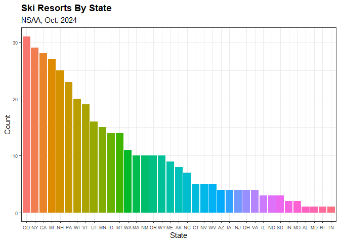
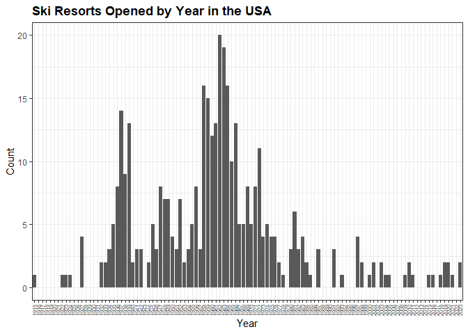
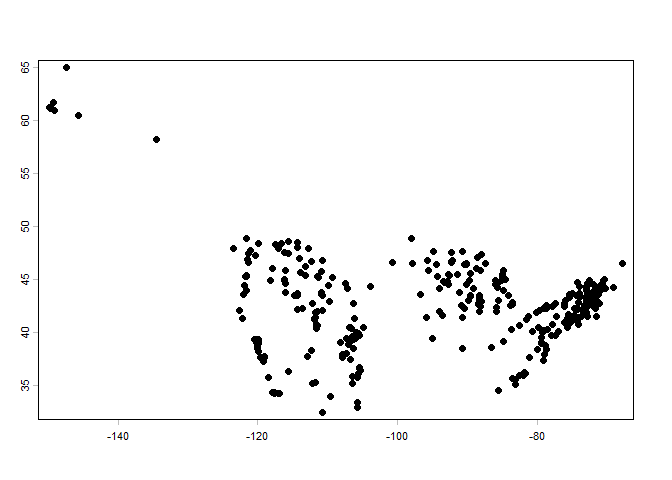
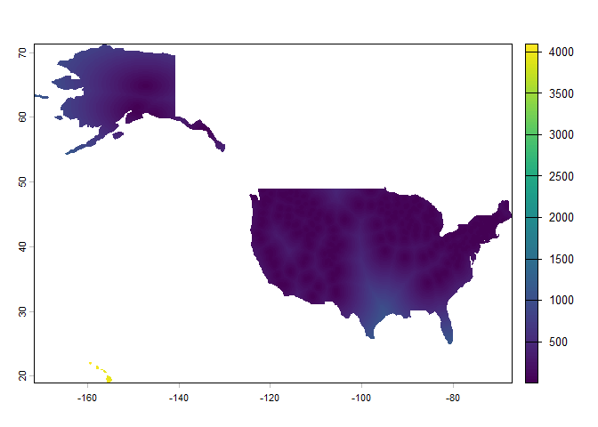

# Ski Area Raster
Luke Petrus

``` r
# Loads packages
library(tidyverse)
```

# Intro

The next step on my journey to build a weighted raster overlay model to
determine where I should live is creating a raster that represents the
distance from the center of each cell to the nearest ski area.

# Ski Resort Point Data

## Data

#### Loading Data

I have found a reasonably thorough list of ski resorts published by the
National Ski Area Association. This data was downloaded from their
website as a pdf, then converted from that into an excel file, where I
made some further formatting edits to get the data properly organized as
a table. From there I am able to import the data to here.

``` r
# Reads in my data
skiData <- read_csv("skiAreaData.csv")
knitr::kable(head(skiData))
```

| Ski Area                    | State | Website                      | Year Opened |
|:----------------------------|:------|:-----------------------------|------------:|
| Howelsen Hill Ski Area      | CO    | www.steamboatsprings.net/ski |        1915 |
| Eaglebrook School           | MA    | www.eaglebrook.org           |        1922 |
| Storrs Hill Ski Area        | NH    | www.skistorrshill.com        |        1923 |
| Mountain High Resort        | CA    | www.mthigh.com               |        1924 |
| Cooper Spur Mountain Resort | OR    | www.cooperspur.com           |        1927 |
| Granlibakken Tahoe Ski Area | CA    | www.granlibakken.com         |        1927 |

Wow! Look at that, a list of ski resorts, their states, and the year
they opened. Obviously, the next step will have to be geocoding these
resorts so I can use them for spatial analysis. Before I go there, let’s
take a quick detour through some exploratory data analysis just to see
what trends might be hiding here.

#### EDA

First, a bar chart of resorts by state:

``` r
# Generates a bar chart of ski resorts by state.
areasByState <- skiData |> 
  mutate(State = fct_infreq(factor(State))) |> 
  ggplot() +
    geom_bar(aes(x = State, fill = State)) +
    theme_bw() +
    labs(
      title = "Ski Resorts By State",
      x = "State",
      y = "Count",
      subtitle = "NSAA, Oct. 2024"
    ) +
    theme(plot.title = element_text(face = "bold"),
          legend.position = "none",
          axis.text = element_text(size = 7))

areasByState
```



And now a bar chart showing ski resorts founded per year:

``` r
years <- tibble(Est = c(1915:2023))

byYear <- skiData |> 
  rename(Est = `Year Opened`) |> 
  group_by(Est) |> 
  summarise(n()) |> 
  full_join(years, by = join_by(Est)) |> 
  replace_na(list(`n()` = 0)) |> 
  arrange(Est) |> 
  mutate(Est = factor(Est)) |> 
  rename(Count = `n()`)

areasByYear <- ggplot(byYear) +
    geom_col(aes(x = Est, y = Count)) +
    labs(
      title = "Ski Resorts Opened by Year in the USA",
      x = "Year",
      y = "Count"
    ) +
    theme_bw() +
    theme(plot.title = element_text(face = "bold"),
          axis.text.x = element_text(angle = 90, vjust = 0.35, size = 6))

areasByYear
```



## Geocoding

One problem with this data as it stands right now is the lack of
location data. I could, of course, manually input the location data
using the website links provided for each resort in the table. This
would probably take eight hours or more, though, so first lets try
geocoding based on their names and hope for the best.

Actually, I did a little reading on Geocodio before I bothered writing
the code to try, so I am pretty confident that their service won’t do
what I need. The problem is that I have the names of the businesses, but
not their addresses. I would first have to find all their addresses to
use this method. Time to research other solutions. . .

Perhaps this is an opportunity to learn web scraping. . . .

After some more reading and exploring, it looks like a good bet for
getting locations for all these places might be the Google Places API.
This should let me feed in the resort names just like I’m searching for
the resort on Google Maps. To do this, I’m going to need to learn the
ins and outs of API programming in R, something not generally considered
to be one of R’s strong suits, at least compared to Python. One language
at a time, though.

## Google Places API

------------------------------------------------------------------------

**Nothing in this section is evaluated in the .md because I am not
willing to rerun the API just to get bad data that I can fix again.**

------------------------------------------------------------------------

To work with APIs in R, it is best to use the `httr2` package.

``` r
library(httr2)
```

Now, after reading through the documentation, it appears that the best
way to do this is to use Text Search Essentials to obtain the Place ID
and Place Type, filter the results by Place Type to make sure I have a
ski resort, then use Place Details Essentials to obtain the location for
this place. I should be able to do all this through the Google Places
API for free. Now the challenge is writing the code to make it happen.
It seems I will need design a function that does this, then use a for
loop to apply that function to every ski resort in my list. Learning
APIs is making my brain hurt, though, so before we make this recursive,
lets see if we can use the Google Places API to get the location of
Bridger Bowl.

``` r
#API Key
skiKey <- Sys.getenv("GOOGLE_SKI_KEY")

#Search term
query <- "Bridger Bowl Ski Area"

#Defines the HTTP POST request I am sending to the Google Places API
firstRequest <- request("https://places.googleapis.com/v1/places:searchText") |> 
  req_body_json(
    list(
      textQuery = query,
      `includedType` = "ski_resort"
    )
  ) |> 
  req_headers(
    `content-type` = "application/json",
    `x-goog-fieldmask` = "places.id,places.displayName,places.location",
    `x-goog-api-key` = skiKey
  )

#Performs the POST and saves the result
result <- req_perform(firstRequest)

#Displays the result
resp_raw(result)
```

Sweet baby Jesus, it worked! That looks like the right location to me (I
happen to know that Bozeman is just under 46 North by 111 West). Now,
lets see if we can get this into a tibble.

``` r
#Turns the json into a nested list
result1 <- result |> 
  resp_body_json()

#Check to see if I understand how to access specific elements of that list
result1$places[[1]]$location$latitude

#Creates a tibble I can left_join to the other dataset
tibble(Name = result1$places[[1]]$displayName$text, 
       GoogID = result1$places[[1]]$id,
       Lat = result1$places[[1]]$location$latitude,
       Long = result1$places[[1]]$location$longitude)
```

That’s all the individual pieces I need, so now I just need to make it
recursive such that it performs these operations for every resort in my
list.

``` r
skiCoords <- function(resortName) {
  # A function for finding lat/long for ski resorts with Google Places API
  # ARGS: resortName = the name of the resort to search for
  # Returns: a 1-row tibble with the desired info
  
  skiKey <- Sys.getenv("GOOGLE_SKI_KEY")
  
  # Defines the request
  req1 <- request("https://places.googleapis.com/v1/places:searchText") |> 
  req_body_json(
    list(
      textQuery = resortName,
      `includedType` = "ski_resort"
    )
  ) |> 
  req_headers(
    `Content-Type` = "application/json",
    `X-Goog-FieldMask` = "places.id,places.displayName,places.location",
    `X-Goog-Api-Key` = skiKey
  )
  
  #Performs the request and saves the results
  resp1 <- req1 |> req_perform() |> resp_body_json()
  
  #Checks to see if there is a result. If not, returns an empty tibble
  if (length(resp1$places) == 0) 
    return(tibble())
  
  #Slows the function down to avoid making too many requests too fast
  Sys.sleep(0.1)
  
  #Makes a 1-row tibble with the desired info
  tibble(searchName = resortName,
         dispName = resp1$places[[1]]$displayName$text, 
         googID = resp1$places[[1]]$id,
         lat = resp1$places[[1]]$location$latitude,
         long = resp1$places[[1]]$location$longitude)
  
}

safeSkiCoords <- possibly(skiCoords, otherwise = tibble())

littleBoy <- map(skiData$`Ski Area`, safeSkiCoords, .progress = T) |> 
  list_rbind()
```

It worked! After some tinkering and a fair bit of consulting with Gemini
to make sure I got it right the first time and didn’t end up spending
money I didn’t need to on Google Places API, we have a list of ski
resorts with location data. I do notice that there are 20 missing
resorts. Lets see if we can figure out which ones those are and if
they’re important enough to merit some manual data entry. Also, lets
save this as a .csv locally so I don’t have to run the API again and
risk having to cough up some dough to Google for my mistake.

## Data Cleaning

#### Sloppy API & Merge Results

``` r
#Creates a table of the missed hills
missedHills <- anti_join(skiData, bigBoy, by = join_by(`Ski Area` == searchName))

sloppySkiCoords <- function(resortName) {
  # A function for finding lat/long for ski resorts with Google Places API
  # made sloppier by removing the includedType filter to try and get coords
  # for the last 20 hills
  # ARGS: resortName = the name of the resort to search for
  # Returns: a 1-row tibble with the desired info
  
  skiKey <- Sys.getenv("GOOGLE_SKI_KEY")
  
  # Defines the request
  req2 <- request("https://places.googleapis.com/v1/places:searchText") |> 
  req_body_json(
    list(
      textQuery = resortName
    )
  ) |> 
  req_headers(
    `Content-Type` = "application/json",
    `X-Goog-FieldMask` = "places.id,places.displayName,places.location",
    `X-Goog-Api-Key` = skiKey
  )
  
  #Performs the request and saves the results
  resp2 <- req2 |> req_perform() |> resp_body_json()
  
  #Checks to see if there is a result. If not, returns an empty tibble
  if (length(resp2$places) == 0) 
    return(tibble())
  
  #Slows the function down to avoid making too many requests too fast
  Sys.sleep(0.1)
  
  #Makes a 1-row tibble with the desired info
  tibble(searchName = resortName,
         dispName = resp2$places[[1]]$displayName$text, 
         googID = resp2$places[[1]]$id,
         lat = resp2$places[[1]]$location$latitude,
         long = resp2$places[[1]]$location$longitude)
  
}

# Possibly() defends against any interruptions that could occur and returns an empty tibble if the API call breaks somewhere along the way
safeSloppySkiCoords <- possibly(sloppySkiCoords, otherwise = tibble())

# This runs the safe API call for all my missed hills then binds the results into a tibble
bigBoy <- map(missedHills$`Ski Area`, safeSloppySkiCoords, .progress = T) |> 
  list_rbind()

# Adds my two data sets together
semifinal <- littleBoy |> 
  add_row(bigBoy)
```

Just noticed that Buttermilk got coded as Mountains Walking Brewery.
That’s wrong, so lets go ahead and fix it. Otherwise, everything looks
pretty good.

``` r
# Fixes Buttermilk's location
bigBoy <- bigBoy |>
  mutate(
    lat = case_when(
      searchName == "Buttermilk" ~ 39.2085, # Actual Buttermilk, CO Lat
      TRUE ~ lat
    ),
    long = case_when(
      searchName == "Buttermilk" ~ -106.8580, # Actual Buttermilk, CO Long
      TRUE ~ long
    ),
    dispName = case_when(
      searchName == "Buttermilk" ~ "Buttermilk Ski Area (Corrected)",
      TRUE ~ dispName
    )
  )

# Joins the fixed datasets
semifinal <- littleBoy |> 
  add_row(bigBoy)

# Joins the key information from each dataset to create a final version
finalSkiData <- skiData |> 
  select(`Ski Area`, State, Website, `Year Opened`) |> 
  unique() |> 
  left_join(unique(semifinal), by = join_by(`Ski Area` == searchName))
```

Alright, that looks good. Lets save it as a .csv.

``` r
# Writes to a csv in the current working directory
write_csv(finalSkiData, "finalSkiData.csv")
```

``` r
#Reads it back in so I can continue my work without rerunning the above code.
finalSkiData <- read_csv("finalSkiData.csv")
```

#### Map Check

Aaaand a quick map, just for fun.

``` r
# For ground truthing. Not rendered in the .md

library(leaflet)

# Generates a leaflet map with my points
leaflet(finalSkiData) |> 
  addProviderTiles("Esri.WorldImagery") |> 
  addMarkers(lng = finalSkiData$long,
             lat = finalSkiData$lat,
             label = paste(finalSkiData$`Ski Area`, finalSkiData$State, sep = " - "))
```

#### Map Fixes

Well, looking at the map, there are some clear mistakes. For example,
Mt. Zion is supposed to be in MI, not Israel. Likewise with that one in
Spain. Also, I found one that is supposed to be in NY (Polar Peak) which
has been placed in Oregon. Another (Gateway Hills) was supposed to be in
NH, but instead its in ID. Another (The Homestead) is in WV but should
be in MI. Powder Ridge should be in MN, not CT. Alpine Valley OH is in
MI for some reason. Bluebird CO is in MT, and the National Ski
Association is marked where Bridger bowl is. These are all things that
will need fixed, but that’s work for another day.

And, now its another day, so lets clean this data up. In the interest of
not burning through all my Google API credit trying to find a perfect
way to get everything properly positioned, I am going to manually recode
the resorts I identified above using the case_when() system I used above
for Buttermilk.

``` r
# Fixes some points in what I suspect is a very inefficient way
finalSkiData1 <- finalSkiData |> 
  mutate(
    lat = case_when(
      `Ski Area` == "Mt. Zion" ~ 46.47432,
      T ~ lat
    ),
    long = case_when(
      `Ski Area` == "Mt. Zion" ~ -90.16355,
      T ~ long
    ),
    lat = case_when(
      `Ski Area` == "Gateway Hills Snow Park" ~ 42.71472,
      T ~ lat
    ),
    long = case_when(
      `Ski Area` == "Gateway Hills Snow Park" ~ -71.45277,
      T ~ long
    ),
    lat = case_when(
      `Ski Area` == "The Homestead" ~ 44.91343,
      T ~ lat
    ),
    long = case_when(
      `Ski Area` == "The Homestead" ~ -85.96420,
      T ~ long
    ),
    lat = case_when(
      `Ski Area` == "Powder Ridge Ski Area" ~ 45.34361,
      T ~ lat
    ),
    long = case_when(
      `Ski Area` == "Powder Ridge Ski Area" ~ -94.30522,
      T ~ long
    ),
    lat = case_when(
      `Ski Area` == "Alpine Valley Ski Area" & State == "OH" ~ 41.52912,
      T ~ lat
    ),
    long = case_when(
      `Ski Area` == "Alpine Valley Ski Area" & State == "OH" ~ -81.25914,
      T ~ long
    ),
    lat = case_when(
      `Ski Area` == "Bluebird Backcountry" ~ 40.36660,
      T ~ lat
    ),
    long = case_when(
      `Ski Area` == "Bluebird Backcountry" ~ -106.53585,
      T ~ long
    )
  ) |> 
  filter(!`Ski Area` %in% c("Xanadu SnowParkc/o Select Contracts", #Name change
                         "Polar Peak Ski Bowl", #Not public
                         "National Ski Areas Association")) #Not a hill
```

That should take care of the mistakes I saw. Lets remap it and see.

``` r
# For ground truthing. Not rendered in the .md

# Another leaflet map
leaflet(finalSkiData1) |> 
  addProviderTiles("Esri.WorldImagery") |> 
  addMarkers(lng = finalSkiData1$long,
             lat = finalSkiData1$lat,
             label = paste(finalSkiData1$`Ski Area`, 
                           finalSkiData1$State, sep = " - "))
```

#### More Fixes

The code works, but I just noticed that Meadowlark in WY was mapped to
Hogadon. This is a mistake due to the fact that I filtered for ski
resorts, but meadowlark is on Google maps as a lodging. Goddamnit. Ope,
and there’s Tamarack resort in Cali which is supposed to be in Idaho.
Makes me wonder how many more resorts I lack the prior knowledge/context
to catch. It is especially hard since in the case of Meadowlark and
Hogadon, as well as several others, they’re both geocoded to the same
location and overlap perfectly.

``` r
# Even more horrendously inefficient fixes
finalSkiData <- finalSkiData1 |> 
  mutate(
    lat = case_when(
      `Ski Area` == "Meadowlark Ski Lodge" ~ 44.17375,
      T ~ lat
    ),
    long = case_when(
      `Ski Area` == "Meadowlark Ski Lodge" ~ -107.21473,
      T ~ long
    ),
    lat = case_when(
      `Ski Area` == "Tamarack Resort" ~ 44.67260,
      T ~ lat
    ),
    long = case_when(
      `Ski Area` == "Tamarack Resort" ~ -116.11587,
      T ~ long
    )
  )
```

Well, I’m determined to make this data set as perfect as possible, so
lets see what we can do.

``` r
# Checks how many distinct longitudes there are
finalSkiData |> 
  distinct(long) |> 
  count()

# Checks how many distinct latitudes there are
finalSkiData |> 
  distinct(lat) |> 
  count()

# Checks how many distinct resorts there are
finalSkiData |> 
  distinct(`Ski Area`) |> 
  count()
```

Goddamnit. These three queries imply that there are something like 10
more ski areas that have overlapping coordinates that I haven’t found
yet. Massive PITA. Oh well. Lets make a list.

``` r
# Creates an organized list of the duplicate coordinates
finalSkiData |> 
  group_by(lat) |> 
  filter(n() > 1) |> 
  ungroup() |> 
  arrange(lat)
```

#### Even More Fixes

Amazingly, Hogadon and Bristol mountain are at the exact same latitude
to a ridiculous degree of precision, but their longitudes are different,
so that pair can be ignored. Otherwise, all the others need to be
checked and adjusted. Fuck. Making this data set is taking an insane
amount of time. Still less than coding them all by hand, but jeez! Let’s
get to work. Sounds like I’ll need to move 9 of the 18, since out of
each duplicate pair, one of the two should hopefully be in the right
location. Still doesn’t guarantee that all of them got coded in the
right place, but without checking every single one against satellite
imagery to look for ski infrastructure, I don’t know what else I could
do.

``` r
# Even more fixes. Boy, this is tiring
finalSkiData2 <- finalSkiData |> 
  mutate(
    lat = case_when(
      `Ski Area` == "Elk Ridge Ski & Outdoor Recreation Area" ~ 35.21517,
      T ~ lat
    ),
    long = case_when(
      `Ski Area` == "Elk Ridge Ski & Outdoor Recreation Area" ~ -112.193,
      T ~ long
    ),
    lat = case_when(
      `Ski Area` == "Pajarito Mountain Ski Area" ~ 35.89482,
      T ~ lat
    ),
    long = case_when(
      `Ski Area` == "Pajarito Mountain Ski Area" ~ -106.39073,
      T ~ long
    ),
    lat = case_when(
      `Ski Area` == "Eagle Rock Ski Area" ~ 40.92371,
      T ~ lat
    ),
    long = case_when(
      `Ski Area` == "Eagle Rock Ski Area" ~ -76.10450,
      T ~ long
    ),
    lat = case_when(
      `Ski Area` == "Snow Schoolers @ Kingvale" ~ 39.31334,
      T ~ lat
    ),
    long = case_when(
      `Ski Area` == "Snow Schoolers @ Kingvale" ~ -120.44573,
      T ~ long
    ),
    lat = case_when(
      `Ski Area` == "Deer Mountain Ski Resort" ~ 44.30852,
      T ~ lat
    ),
    long = case_when(
      `Ski Area` == "Deer Mountain Ski Resort" ~ -103.81832,
      T ~ long
    ),
    lat = case_when(
      `Ski Area` == "The Villas at Tree Tops and Fairway White Lightning Snow Tubing" ~ 41.07792,
      T ~ lat
    ),
    long = case_when(
      `Ski Area` == "The Villas at Tree Tops and Fairway White Lightning Snow Tubing" ~ -75.02513,
      T ~ long
    ),
    lat = case_when(
      `Ski Area` == "Crystal Mountain" ~ 44.51991,
      T ~ lat
    ),
    long = case_when(
      `Ski Area` == "Crystal Mountain" ~ -85.99218,
      T ~ long
    )
  ) |> 
  filter(`Ski Area` != "Kingvale Snow Schoolers",
         `Ski Area` != "Big Snow Resort")
```

Okay, with luck this should be good. Time to check.

``` r
# Makes that list again
finalSkiData2 |> 
  group_by(long) |> 
  filter(n() > 1) |> 
  ungroup() |> 
  arrange(long)
```

#### Final Data Expot

Beautiful. Final touches. . . .

``` r
# Makes it Geanette McPurdy
finalSkiData <- finalSkiData2 |> 
  select(!dispName) |> 
  mutate(lat = round(lat, 5),
         long = round(long, 5))

# Writes it to a csv so I don't have to rerun this section to get my data  
write_csv(finalSkiData, "finalSkiData.csv")
```

# Distance Raster From Points

Now that I have the data set cleaned, fixed, and generally in a
condition that I think is tolerable, it is time to make a raster from
these points. First step is to load back in the ski data so I don’t have
to run all the above cells to work on the raster section.

``` r
# Reloads tidyverse for when I'm starting at this section.
library(tidyverse)
library(terra)

# Loads the data
finalSkiData <- read_csv("finalSkiData.csv")

# Turns the data into a spatVector object (will be useful later)
skiPoints <- vect(finalSkiData, crs = "EPSG:4326", geom = c("long", "lat"))

# A plot to check my points worked
plot(skiPoints)
```



Yeah buddy! We’ve got a vector object with all the ski areas represented
as points that still contains their identifying info. Now to do a
distance raster.

``` r
library(rnaturalearth)
library(rnaturalearthdata)
library(sf)

# Creates a spatVector of the USA
usaVect <- ne_countries(country = "united states of america", returnclass = "sv")

# Creates an empty raster
emptDistRaster <- rast(crs = "EPSG:4326", 
                   extent = ext(usaVect), 
                   resolution = 0.05)

# Calculates the distance to any cell in the empty raster from the nearest point in
# skiPoints
distRaster <- distance(emptDistRaster, skiPoints, unit = "km", method = "cosine")

# Clips the raster to just the USA
distRaster <- mask(distRaster, usaVect)

# A plot to see just what witch's brew I cooked up
plot(distRaster)
```



I think that did it. I will need to remove HI if I want the color scale
to make sense, but this is the raster I needed. It seems logical and I
don’t see why it wouldn’t be correct.

``` r
writeRaster(distRaster, "prelimSkiRaster.tif", overwrite = T)
```

## Citations

#### Data

<https://www.nsaa.org/NSAA/About/Media/Industry_Stats/NSAA/About/Media/Industry_Stats.aspx>
